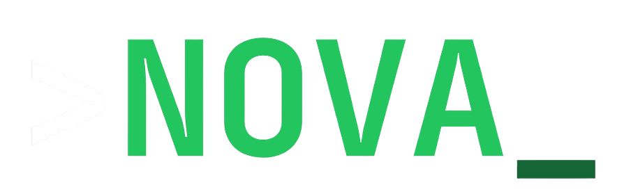

<div align="center">



# NOVA Frontend

The web UI of **Neural Orchestration & Virtual Agent** — and its only interface

[](https://www.linkedin.com/in/thisisrobyn)
[](https://github.com/thisisrobyn)
[](https://github.com/nova-ai-sys/nova-frontend/stargazers)

</div>

## What this is

A React app: the chat, the live multi-agent run diagram, memory and knowledge
base, the scheduler, connected accounts, host metrics and the documentation
reader.

It runs **on your own machine** and talks to
[nova-api](https://github.com/nova-ai-sys/nova-api) on `localhost:8000`. It is
never deployed, and there is no login.

## Install

Start [nova-api](https://github.com/nova-ai-sys/nova-api) first — the UI has
nothing to talk to otherwise.

```bash
npm install
npm run dev
```

Open **http://localhost:5173**.

In development, Vite proxies `/api` to `http://localhost:8000`, so the browser
sees one origin and CORS never comes up. To point at an API somewhere else, set
`VITE_API_URL` — see `.env.example`.

## Commands

| Command | What it does |
|---------|-------------|
| `npm run dev` | Dev server on port 5173, with the API proxy |
| `npm run build` | Type-check and build into `dist/` |
| `npm run preview` | Serve the built app |
| `npm run lint` | ESLint |

## The rest of NOVA

| Repository | What it is |
|------------|------------|
| [nova-api](https://github.com/nova-ai-sys/nova-api) | The agent and the REST API |
| [nova-docs](https://github.com/nova-ai-sys/nova-docs) | The documentation |
| [nova-landing](https://github.com/nova-ai-sys/nova-landing) | The public site |

Full documentation at **[nova.robyn.es/docs](https://nova.robyn.es/docs)**.

## License

MIT

---

<div align="center">
  <a href="https://robyn.es">ROBYN</a> © 2026 — built, not decorated
</div>
